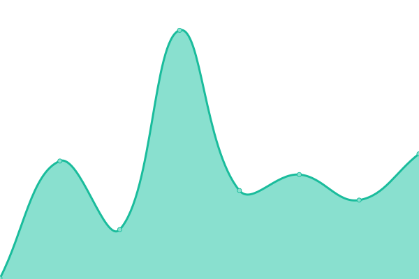

# [📈 Live Status](https://upptime.github.io/upptime): <!--live status--> **🟩 All systems operational**

This repository contains the open-source uptime monitor and status page for [Upptime](https://upptime.js.org), powered by [Upptime](https://github.com/upptime/upptime).

With [Upptime](https://upptime.js.org), you can get your own unlimited and free uptime monitor and status page, powered entirely by a GitHub repository. We use [Issues](https://github.com/upptime/upptime/issues) as incident reports, [Actions](https://github.com/aesotillo/test-uptime/actions) as uptime monitors, and [Pages](https://upptime.github.io/upptime) for the status page.

<!--start: status pages-->
<!-- This summary is generated by Upptime (https://github.com/upptime/upptime) -->
<!-- Do not edit this manually, your changes will be overwritten -->
<!-- prettier-ignore -->
| URL | Status | History | Response Time | Uptime |
| --- | ------ | ------- | ------------- | ------ |
|  [asotillo website](https://asotillo.com) | 🟩 Up | [asotillo-website.yml](https://github.com/aesotillo/test-uptime/commits/HEAD/history/asotillo-website.yml) | 

 218ms
     
 | 

<a href="https://aesotillo.github.io/test-uptime/history/asotillo-website">100.00%</a>
    

|  [tuhogarfeliz](https://tuhogarfeliz.cl) | 🟩 Up | [tuhogarfeliz.yml](https://github.com/aesotillo/test-uptime/commits/HEAD/history/tuhogarfeliz.yml) | 

 267ms
     
 | 

<a href="https://aesotillo.github.io/test-uptime/history/tuhogarfeliz">100.00%</a>
    

|  [club dartel](https://clubdartel.cl) | 🟩 Up | [club-dartel.yml](https://github.com/aesotillo/test-uptime/commits/HEAD/history/club-dartel.yml) | 

 1525ms
     
 | 

<a href="https://aesotillo.github.io/test-uptime/history/club-dartel">100.00%</a>
    

|  [erp](https://erp.thefamily.dev/authentication/login) | 🟩 Up | [erp.yml](https://github.com/aesotillo/test-uptime/commits/HEAD/history/erp.yml) | 

 197ms
     
 | 

<a href="https://aesotillo.github.io/test-uptime/history/erp">100.00%</a>
    

<!--end: status pages-->

[**Visit our status website →**](https://upptime.github.io/upptime)

## 📄 License

- Powered by: [Upptime](https://github.com/upptime/upptime)
- Code: [MIT](./LICENSE) © [Upptime](https://upptime.js.org)
- Data in the `./history` directory: [Open Database License](https://opendatacommons.org/licenses/odbl/1-0/)
